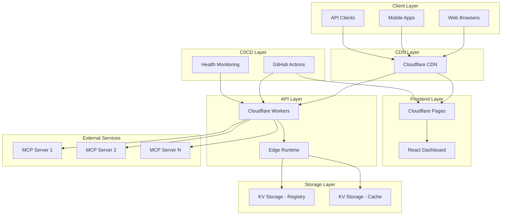
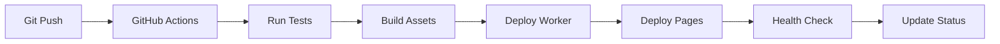

# MCP Hub Architecture 🏗️

This document provides a comprehensive overview of the MCP Hub architecture, design decisions, and implementation details.

## 🎯 System Overview

MCP Hub is a serverless, cloud-native application built entirely on free-tier services. It serves as a central registry, gateway, and orchestration layer for Model Context Protocol (MCP) servers.

### Core Principles
- **100% Free**: Built on free-tier services (Cloudflare Workers + Cloudflare Pages)
- **Serverless**: No server management, automatic scaling
- **Performance**: Global CDN, edge computing, aggressive caching
- **Security**: Built-in DDoS protection, rate limiting, secure headers
- **Reliability**: 99.9% uptime SLA, automatic failover

## 🏛️ High-Level Architecture



## 🔧 Component Architecture

### Frontend (GitHub Pages)

**Technology Stack:**
- React 18 with TypeScript
- Vite for build tooling and HMR
- Tailwind CSS for styling
- React Router for client-side routing

**Key Components:**
```
dashboard/src/
├── components/          # Reusable UI components
│   ├── Header.tsx      # Navigation header
│   ├── ServerCard.tsx  # Server display card
│   ├── SearchBar.tsx   # Search and filtering
│   ├── HealthStatus.tsx # Health status indicators
│   └── ThemeToggle.tsx # Dark/light mode toggle
├── pages/              # Route components
│   ├── Home.tsx        # Landing page
│   ├── Browse.tsx      # Server browser
│   ├── ServerDetail.tsx # Server details
│   ├── AddServer.tsx   # Server submission
│   └── Docs.tsx        # Documentation
├── hooks/              # Custom React hooks
│   └── useHealthCheck.ts # Health monitoring
├── utils/              # Utility functions
│   ├── api.ts          # API client
│   └── validation.ts   # Form validation
└── contexts/           # React contexts
    └── ThemeContext.tsx # Theme management
```

**Design Patterns:**
- **Component Composition**: Reusable, composable components
- **Custom Hooks**: Shared stateful logic
- **Context API**: Global state management
- **Error Boundaries**: Graceful error handling
- **Lazy Loading**: Code splitting for performance

### Backend (Cloudflare Workers)

**Technology Stack:**
- TypeScript with ES2022 target
- Cloudflare Workers Runtime
- KV Storage for persistence
- Scheduled Events for cron jobs

**Key Components:**
```
worker/src/
├── index.ts            # Main entry point
├── router.ts           # Request routing
├── registry.ts         # Server registry management
├── proxy.ts            # MCP server proxy
├── health.ts           # Health checking
├── schema-federation.ts # Schema merging
├── auth.ts             # Authentication
├── cache.ts            # Response caching
├── rate-limit.ts       # Rate limiting
└── types.ts            # TypeScript definitions
```

**Request Flow:**
1. **Request Reception**: Worker receives HTTP request
2. **Rate Limiting**: Check request limits per IP
3. **Authentication**: Validate API keys if required
4. **Routing**: Route to appropriate handler
5. **Processing**: Execute business logic
6. **Caching**: Cache response if applicable
7. **Response**: Return formatted response

## 💾 Data Architecture

### KV Storage Design

**Registry Namespace (`MCP_REGISTRY`)**
```
servers:{id}           → Server metadata
servers:list           → List of all server IDs
servers:verified       → List of verified server IDs
servers:tags:{tag}     → Servers with specific tag
stats:global           → Global statistics
```

**Cache Namespace (`MCP_CACHE`)**
```
health:summary         → Health check summary (TTL: 5min)
health:{id}           → Individual server health (TTL: 30min)
schema:federated      → Federated schema (TTL: 1hr)
schema:{id}           → Individual server schema (TTL: 1hr)
proxy:logs:{date}     → Proxy request logs (TTL: 7d)
```

**Data Models:**
```typescript
interface MCPServer {
  id: string;
  name: string;
  description: string;
  url: string;
  version: string;
  tags: string[];
  author: {
    name: string;
    url?: string;
    github?: string;
  };
  capabilities?: string[];
  authentication?: {
    type: 'api-key' | 'oauth';
    required: boolean;
  };
  rateLimit?: {
    requests: number;
    window: string;
  };
  verified: boolean;
  healthStatus: 'online' | 'degraded' | 'offline' | 'unknown';
  lastChecked: string;
  createdAt: string;
  updatedAt: string;
}
```

## 🔄 API Design

### RESTful Principles
- **Resource-based URLs**: `/api/servers/{id}`
- **HTTP Methods**: GET, POST, PUT, DELETE
- **Status Codes**: Proper HTTP status codes
- **Content Negotiation**: JSON by default
- **Versioning**: URL-based versioning (`/api/v1/`)

### Response Format
```typescript
interface APIResponse<T> {
  success: boolean;
  data?: T;
  error?: string;
  meta?: {
    total?: number;
    page?: number;
    limit?: number;
  };
}
```

### Error Handling
```typescript
interface APIError {
  code: string;
  message: string;
  details?: any;
  timestamp: string;
}
```

## 🔒 Security Architecture

### Defense in Depth
1. **CDN Layer**: DDoS protection, WAF rules
2. **Worker Layer**: Rate limiting, input validation
3. **Application Layer**: Authentication, authorization
4. **Data Layer**: Encryption at rest, access controls

### Rate Limiting Strategy
```typescript
interface RateLimit {
  requests: number;    // Max requests
  window: number;      // Time window (seconds)
  burst: number;       // Burst allowance
  penalty: number;     // Penalty duration
}

const rateLimits = {
  global: { requests: 100, window: 60, burst: 10, penalty: 300 },
  proxy: { requests: 50, window: 60, burst: 5, penalty: 600 },
  submit: { requests: 5, window: 3600, burst: 1, penalty: 1800 }
};
```

### Security Headers
```typescript
const securityHeaders = {
  'X-Content-Type-Options': 'nosniff',
  'X-Frame-Options': 'DENY',
  'X-XSS-Protection': '1; mode=block',
  'Referrer-Policy': 'strict-origin-when-cross-origin',
  'Content-Security-Policy': "default-src 'self'; script-src 'self' 'unsafe-inline'",
  'Strict-Transport-Security': 'max-age=31536000; includeSubDomains'
};
```

## 📊 Monitoring & Observability

### Health Monitoring
- **Automated Checks**: Every 30 minutes via cron
- **Health Metrics**: Response time, status code, availability
- **Alerting**: GitHub Issues for critical failures
- **Dashboard**: Real-time status display

### Performance Monitoring
- **Response Times**: P50, P95, P99 percentiles
- **Error Rates**: 4xx and 5xx error tracking
- **Cache Hit Rates**: KV storage performance
- **Worker Metrics**: CPU time, memory usage

### Logging Strategy
```typescript
interface LogEntry {
  timestamp: string;
  level: 'info' | 'warn' | 'error';
  message: string;
  context?: any;
  requestId?: string;
  userId?: string;
}
```

## 🚀 Deployment Architecture

### CI/CD Pipeline


### Environment Strategy
- **Development**: Local development with hot reload
- **Staging**: Preview deployments for PRs
- **Production**: Main branch auto-deployment

### Rollback Strategy
- **Worker**: Instant rollback via Wrangler CLI
- **Pages**: Git revert + redeploy
- **Database**: Versioned schema migrations

## 🔧 Configuration Management

### Environment Variables
```typescript
interface Environment {
  ENVIRONMENT: 'development' | 'staging' | 'production';
  RATE_LIMIT_REQUESTS: string;
  RATE_LIMIT_WINDOW: string;
  HEALTH_CHECK_INTERVAL: string;
  CACHE_TTL_DEFAULT: string;
}
```

### Feature Flags
```typescript
interface FeatureFlags {
  ENABLE_SCHEMA_FEDERATION: boolean;
  ENABLE_PROXY_LOGGING: boolean;
  ENABLE_ADVANCED_ANALYTICS: boolean;
  MAINTENANCE_MODE: boolean;
}
```

## 📈 Scalability Considerations

### Horizontal Scaling
- **Cloudflare Workers**: Automatic global scaling
- **KV Storage**: Eventually consistent, globally distributed
- **GitHub Pages**: Global CDN distribution

### Performance Optimizations
- **Edge Caching**: 5-minute response caching
- **KV Caching**: 1-hour schema caching
- **Batch Processing**: Health checks in batches
- **Lazy Loading**: Code splitting in frontend

### Capacity Planning
- **Worker Limits**: 100,000 requests/day (free tier)
- **KV Limits**: 100,000 reads/day, 1,000 writes/day
- **Pages Limits**: 500 builds/month

## 🔮 Future Architecture

### Planned Enhancements
- **Multi-region Deployment**: Active-active setup
- **Advanced Analytics**: Usage patterns, performance insights
- **Real-time Updates**: WebSocket connections
- **Plugin System**: Extensible architecture
- **API Gateway**: Advanced routing and transformation

### Migration Strategy
- **Backward Compatibility**: API versioning
- **Gradual Migration**: Feature flags for rollout
- **Data Migration**: Automated schema updates
- **Zero Downtime**: Blue-green deployments

---

This architecture is designed to be simple, scalable, and maintainable while leveraging the best of modern serverless technologies.
